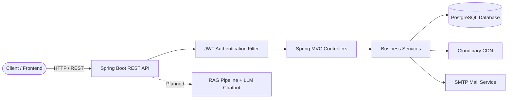
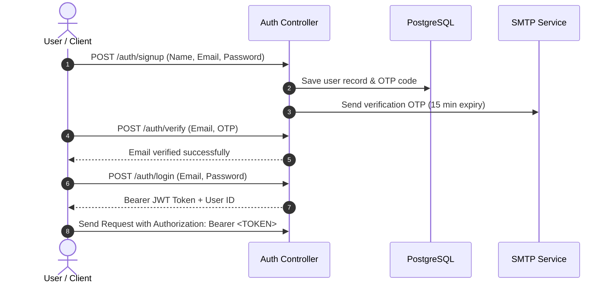
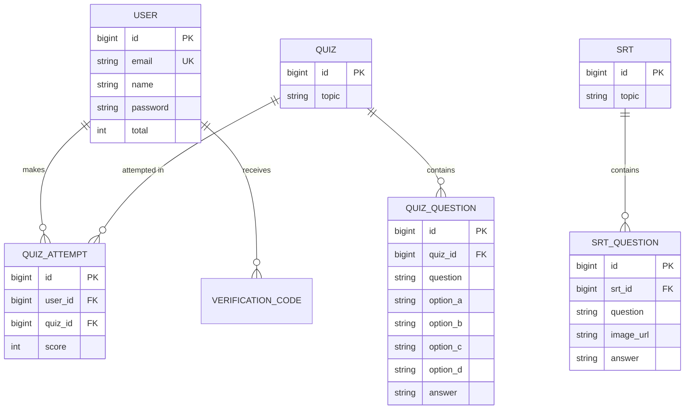
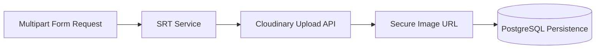
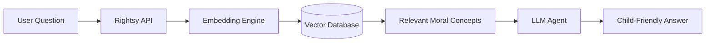

<div align="center">

# 🌱 Rightsy Backend
### *Learn • Play • Grow • Make Better Choices 💙*

A production-ready Spring Boot REST API powering a child-centric interactive learning platform. Featuring **JWT Authentication**, **OTP Workflows**, **Quizzes**, **Situation Reaction Tests (SRT)**, **Automated Scoring**, **PostgreSQL Persistence**, and **Cloudinary Asset Management**.

---

[](https://spring.io/projects/spring-boot)
[](https://www.oracle.com/java/)
[](https://www.postgresql.org/)
[](https://jwt.io/)
[](https://cloudinary.com/)

<br/>


</div>

<br/>

---

## 🟢 Table of Contents

- [About Rightsy](#-about-rightsy)
- [Key Features](#-key-features)
- [System Architecture](#-system-architecture)
- [Project Structure](#-project-structure)
- [Authentication Flow](#-authentication-flow)
- [API Reference](#-api-reference)
  - [Authentication](#authentication)
  - [Quiz Management](#quiz-management)
  - [Situation Reaction Tests (SRT)](#situation-reaction-tests-srt)
- [API Request & Response Examples](#-api-request--response-examples)
- [Database Schema](#-database-schema)
- [Cloudinary Media Flow](#-cloudinary-media-flow)
- [Getting Started](#-getting-started)
- [Postman Setup](#-postman-setup)
- [Error Handling](#-error-handling)
- [AI Chatbot (Upcoming)](#-ai-chatbot-upcoming)
- [Project Status & Roadmap](#-project-status--roadmap)
- [Author](#-author)

---

## 🟢 About Rightsy

**Rightsy** is an interactive learning platform designed to help children learn values, practice sound decision-making, and understand real-life situations through guided quizzes and **Situation Reaction Tests (SRTs)**.

> 💡 **Core Idea:** *Learn a value → Face a situation → Choose an action → Understand the learning behind it.*

---

## 🔵 Key Features

| Module | What It Does |
| :--- | :--- |
| 🔐 **Authentication** | User signup, email verification, login, and stateless JWT security. |
| 📧 **OTP Engine** | Time-limited OTPs for email activation and forgot-password recovery. |
| 🧠 **Quiz Engine** | 4-question interactive quizzes, automated scoring, and attempt tracking. |
| 🎯 **SRT Module** | 3 situation-based dilemma questions with visual cues, prerequisites, and learning notes. |
| ☁️ **Cloudinary** | Automatic file upload and CDN URL persistence for SRT visual assets. |
| 🗃️ **PostgreSQL** | Relational data persistence for accounts, tests, attempts, and learning materials. |
| 🛡️ **Defensive Security** | Spring Security filter chain with BCrypt password hashing and JWT validation. |
| 🤖 **AI Assistant** | Upcoming RAG + LLM chatbot for child-friendly moral reasoning and queries. |

---

## 🟣 System Architecture



---

## 🟠 Project Structure

```text
src/main/java/com/Rightsy/demo/
│
├── controller/     # Exposes REST endpoints
├── Service/        # Core business and validation logic
├── repository/     # Spring Data JPA repositories
├── entity/         # Relational database entities
├── Dto/            # Request and response models
├── security/       # JWT filters, providers, and user details
├── Config/         # SecurityFilterChain, Cloudinary, and CORS config
└── error/          # Centralized global exception handling
```

---

## 🔐 Authentication Flow

Rightsy utilizes stateless token-based authentication with JSON Web Tokens.



### JWT Token Specifications
- **Subject:** User Email Address
- **Custom Claims:** `userId`
- **Validity Duration:** 10 minutes
- **Authorization Header:**
  ```http
  Authorization: Bearer <JWT_TOKEN>
  ```

---

## 🟡 API Reference

**Base URL:** `http://localhost:8080`

### Authentication
| Method | Endpoint | Auth Required | Purpose |
| :--- | :--- | :---: | :--- |
| `POST` | `/auth/signup` | Public | Register new user account |
| `POST` | `/auth/verify` | Public | Verify registration OTP |
| `POST` | `/auth/login` | Public | Authenticate user and receive JWT |
| `POST` | `/auth/forgetPassword` | Public | Send password reset OTP |
| `POST` | `/auth/verifyOtp` | Public | Validate password reset OTP |
| `POST` | `/auth/resetPassword` | Public | Reset account password |

### Quiz Management
| Method | Endpoint | Auth Required | Purpose |
| :--- | :--- | :---: | :--- |
| `POST` | `/admin/create` | JWT | Create a new 4-question quiz |
| `GET` | `/quizzes` | JWT | Retrieve all available quizzes |
| `GET` | `/quiz/{id}` | JWT | Retrieve quiz details by ID |
| `POST` | `/submitQuiz` | JWT | Submit answers & calculate score |
| `GET` | `/getAttempts/{id}` | JWT | Get user attempts for a quiz |
| `DELETE` | `/admin/delete/{id}` | JWT | Delete a quiz by ID |

### Situation Reaction Tests (SRT)
| Method | Endpoint | Auth Required | Purpose |
| :--- | :--- | :---: | :--- |
| `POST` | `/admin/createSrt` | JWT | Upload SRT scenario + 3 images |
| `GET` | `/srt` | JWT | Retrieve all SRT tests |
| `GET` | `/srt/{id}` | JWT | Retrieve a specific SRT test |
| `DELETE` | `/admin/deleteSrt/{id}` | JWT | Delete an SRT test by ID |

> 🔒 **Security Notice:** `/admin/**` endpoints validate authentication. Role-based authorization (`ROLE_ADMIN`) is scheduled for future updates.

---

## 📦 API Request & Response Examples

<details>
<summary><b>1. POST /auth/signup — Signup</b></summary>

**Request:**
```json
{
  "name": "John Doe",
  "email": "john@example.com",
  "password": "password123"
}
```

**Response:**
```json
{
  "id": 1,
  "name": "John Doe",
  "email": "john@example.com",
  "total": 0
}
```
*An OTP is automatically dispatched to the provided email.*
</details>

<details>
<summary><b>2. POST /auth/verify — Verify Email OTP</b></summary>

**Request:**
```json
{
  "email": "john@example.com",
  "code": "123456"
}
```

**Response:**
```json
{
  "message": "Email Verified Successfully",
  "success": true
}
```
*⏱️ OTP validity window: 15 minutes.*
</details>

<details>
<summary><b>3. POST /auth/login — Login</b></summary>

**Request:**
```json
{
  "email": "john@example.com",
  "password": "password123"
}
```

**Response:**
```json
{
  "token": "eyJhbGciOiJIUzI1NiIsInR5cCI6IkpXVCJ9...",
  "id": 1
}
```
</details>

<details>
<summary><b>4. POST /auth/forgetPassword & /auth/resetPassword</b></summary>

**Request (`/auth/forgetPassword`):**
```json
{
  "email": "john@example.com"
}
```

**Response:**
```json
{
  "message": "Opt has been sent to john@example.com",
  "success": true
}
```

**Request (`/auth/resetPassword`):**
```json
{
  "email": "john@example.com",
  "newPassword": "newPassword123"
}
```

**Response:**
```json
{
  "message": "Password Reset Successfully",
  "success": true
}
```
</details>

<details>
<summary><b>5. POST /admin/create — Create Quiz</b></summary>

*Each quiz must contain exactly 4 question objects.*

**Request:**
```json
{
  "topic": "Digital Safety",
  "questions": [
    {
      "question": "What should you do with a suspicious link?",
      "optionA": "Open it",
      "optionB": "Share it",
      "optionC": "Avoid opening it",
      "optionD": "Forward it",
      "answer": "C"
    }
  ]
}
```

**Response:**
```json
{
  "message": "Quiz has been added Successfully",
  "success": true
}
```
</details>

<details>
<summary><b>6. POST /submitQuiz — Submit Quiz</b></summary>

**Request:**
```json
{
  "quizId": 1,
  "answers": [
    { "questionId": 1, "answer": "C" },
    { "questionId": 2, "answer": "A" },
    { "questionId": 3, "answer": "B" },
    { "questionId": 4, "answer": "D" }
  ]
}
```

**Response:**
```json
{
  "message": "Quiz submitted successfully. Score: 40/40",
  "success": true
}
```

**🏆 Scoring Logic:**
- 1 correct answer = 10 points (Max 40/40).
- A `QuizAttempt` record is created for each submission.
- The user's cumulative `total` score only updates on their **first** attempt.
</details>

<details>
<summary><b>7. POST /admin/createSrt — Multipart SRT Creation</b></summary>

**Header:** `Content-Type: multipart/form-data`

| Key | Type | Description |
| :--- | :--- | :--- |
| `srt` | Text (JSON) | Complete SRT scenario structure (3 questions) |
| `images` | File | Image for Question 1 (`images[0]`) |
| `images` | File | Image for Question 2 (`images[1]`) |
| `images` | File | Image for Question 3 (`images[2]`) |

**JSON snippet for `srt` field:**
```json
{
  "topic": "Truthfulness",
  "questions": [
    {
      "question": "You accidentally break a friend's toy. What should you do?",
      "prerequisites": [
        "Think about honesty",
        "Think about responsibility"
      ],
      "optionA": "Hide it",
      "noteA": "Avoids responsibility.",
      "optionB": "Blame someone else",
      "noteB": "Unfair to others.",
      "optionC": "Tell your friend the truth",
      "noteC": "Builds trust.",
      "optionD": "Throw it away",
      "noteD": "Does not solve the problem.",
      "answer": "C"
    }
  ]
}
```

**Response:**
```json
{
  "message": "SRT Has been Added Successfully",
  "success": true
}
```
</details>

---

## 🗃️ Database Schema



---

## ☁️ Cloudinary Media Flow



---

## ⚙️ Getting Started

### Prerequisites
- **JDK 17+**
- **Maven 3.8+**
- **PostgreSQL 14+**
- **Cloudinary Account**
- **SMTP Server / Gmail App Password**

### 1. Clone the Repository
```bash
git clone https://github.com/Ghalib18/RightsyBackend.git
cd RightsyBackend
```

### 2. Configure Database
Launch PostgreSQL and initialize your target schema:
```sql
CREATE DATABASE Rightsy;
```

### 3. Application Properties Setup
Add your environment variables inside `src/main/resources/application.properties`:

```properties
# Server Port
server.port=8080

# PostgreSQL Configuration
spring.datasource.url=jdbc:postgresql://localhost:5432/Rightsy
spring.datasource.username=YOUR_DB_USERNAME
spring.datasource.password=YOUR_DB_PASSWORD
spring.jpa.hibernate.ddl-auto=update
spring.jpa.show-sql=true

# JWT Security
jwt.secretKey=YOUR_256_BIT_SECRET_KEY

# Cloudinary CDN Configuration
cloudinary.cloud_name=YOUR_CLOUD_NAME
cloudinary.api_key=YOUR_API_KEY
cloudinary.api_secret=YOUR_API_SECRET

# SMTP / Email Configuration
spring.mail.host=smtp.gmail.com
spring.mail.port=587
spring.mail.username=YOUR_EMAIL@gmail.com
spring.mail.password=YOUR_GMAIL_APP_PASSWORD
spring.mail.properties.mail.smtp.auth=true
spring.mail.properties.mail.smtp.starttls.enable=true
```

### 4. Run Locally
```bash
# Windows
mvnw.cmd spring-boot:run

# Linux / macOS
./mvnw spring-boot:run
```

API Server starts by default at: `http://localhost:8080`

---

## 🧪 Postman Setup

### Authorization Setup:
For protected endpoints, navigate to:
`Authorization` → Select **Bearer Token** → Paste `<JWT_TOKEN>`.

### Uploading SRT Multipart Requests:
1. Method: `POST` to `/admin/createSrt`
2. Go to **Body** tab → Select **form-data**
3. Configure rows:
   - `srt` (Type: **Text**) → Paste your JSON schema
   - `images` (Type: **File**) → Attach Image 1
   - `images` (Type: **File**) → Attach Image 2
   - `images` (Type: **File**) → Attach Image 3

---

## 🧯 Error Handling

Rightsy uses a unified global exception handler returning standard HTTP statuses:

- `401 Unauthorized`: Missing, expired, or invalid JWT token.
- `403 Forbidden`: Insufficient permissions.
- `404 Not Found`: Requested quiz, SRT, or user does not exist.
- `500 Internal Server Error`: Generic internal system exceptions.

---

## 🤖 AI Chatbot (Upcoming)



**Planned Capabilities:**
- 🔎 Semantic search across moral topics and real-life scenarios.
- 🧠 Context-aware, age-appropriate explanations.
- 💬 Conversational history tracking via a dedicated endpoint (`POST /chat`).

---

## ✅ Project Status & Roadmap

- [x] JWT Authentication & Token Lifecycle
- [x] Email OTP Verification & Account Activation
- [x] Password Recovery via OTP
- [x] Quizzes & Automated First-Attempt Scoring
- [x] Multi-Question Attempt History
- [x] SRT Module with Multipart Cloudinary Uploads
- [x] Global Exception Handling
- [ ] Explicit `ROLE_ADMIN` and `ROLE_USER` Security Checks
- [ ] Swagger / OpenAPI Specification
- [ ] Response sanitization (hide correct answers on learner endpoints)
- [ ] Flyway database migrations
- [ ] RAG + LLM Chatbot Integration
- [ ] Docker containerization & CI/CD pipeline

---

## 👤 Author

**Ghalib Hussain**  
- GitHub: [@Ghalib18](https://github.com/Ghalib18)

<div align="center">

🌱 *Learn Values. Practice Decisions. Build a Better Tomorrow.* 🚀  
⭐ **Star the repository if you find Rightsy useful!** ⭐

</div>
